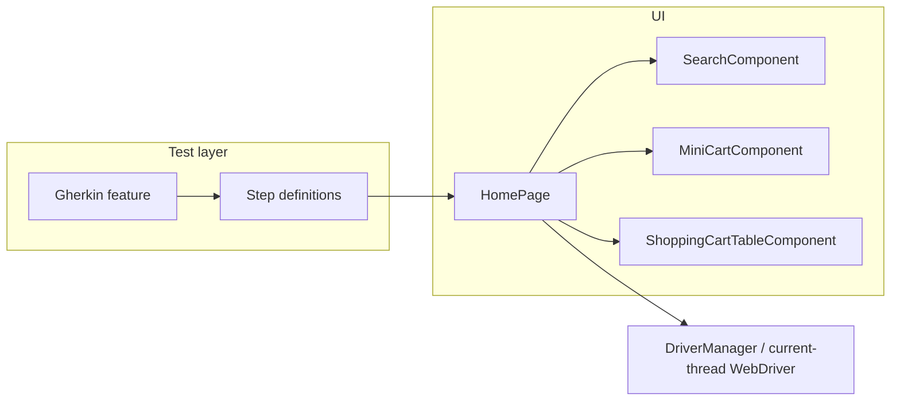

<div align="center">

# UI test automation framework

**Selenium · Cucumber · TestNG · Maven**

[](https://openjdk.org/)
[](https://maven.apache.org/)
[](https://www.selenium.dev/)
[](https://cucumber.io/)
[](https://testng.org/)
[](https://docs.qameta.io/allure/)

End-to-end web automation with **BDD**, **Page Object Model** extended with **reusable UI components**, **parallel** execution per thread, and **reporting** (Cucumber HTML + Allure).

[Requirements](#requirements) · [Configuration](#configuration) · [Running tests](#running-tests) · [Project layout](#project-layout) · [Architecture](#architecture)

</div>

---

## Overview

This project exercises a demo **OpenCart** store. Scenarios are written in **Gherkin**, steps bind to **TestNG**, and the browser is driven with **Selenium 4** (Selenium Manager resolves the Chrome driver).

Highlights:

| Area | Details |
|------|---------|
| **Concurrency** | One `WebDriver` per thread (`ThreadLocal` in `DriverManager`) for parallel Cucumber + TestNG. |
| **POM + components** | `HomePage` composes `SearchComponent`, `MiniCartComponent`, and `ShoppingCartTableComponent`. |
| **Configuration** | Base URL, timeouts, and `headless` are centralized in `config.properties` via `ConfigLoader`. |
| **Assertions** | Business rules live in **step definitions** (TestNG `Assert`); page objects return data or booleans. |
| **Evidence** | Inline screenshots and Allure-ready output under `target/allure-results`. |

---

## Requirements

| Tool | Notes |
|------|--------|
| **JDK 22+** | `maven-enforcer-plugin` enforces `[22,)`. |
| **Maven 3.x** | Build and test execution. |
| **Google Chrome** | Target browser (driver resolved by Selenium Manager). |

---

## Configuration

The source of truth is **`src/main/resources/config.properties`** (Maven copies it to `target/classes`).

| Property | Example | Description |
|----------|---------|-------------|
| `base.url` | `https://opencart.abstracta.us/` | Application entry URL. |
| `timeout.explicit` | `10` | Explicit wait (seconds) for actions and components. |
| `timeout.implicit` | `2` | Driver implicit wait (seconds). |
| `browser` | `chrome` | Intended browser (current runner uses Chrome). |
| `headless` | `false` | Headless mode; can be overridden with `-Dheadless=true`. |

---

## Running tests

**Clone and run**

```bash
git clone https://github.com/hdvergara/selenium-cucumber-testng.git
cd selenium-cucumber-testng
mvn clean test
```

**Typical Maven run** (Cucumber scenarios via `TestRunnerStore`):

```bash
mvn clean test
```

**Headless** (system property, aligned with `DriverManager` / `ConfigLoader`):

```bash
mvn clean test -Dheadless=true
```

**From the IDE**  
Run `src/test/java/framework/automation/runners/TestRunnerStore.java` as a TestNG test.

---

## Project layout

```
src/main/java/framework/automation/
├── components/          # Reusable UI (search, mini-cart, cart table)
│   ├── SearchComponent.java
│   ├── MiniCartComponent.java
│   └── ShoppingCartTableComponent.java
├── manager/
│   └── DriverManager.java      # Per-thread WebDriver (ThreadLocal)
├── pages/
│   └── HomePage.java           # Component composition + “Add to cart” on search results
└── utils/
    ├── ConfigLoader.java
    ├── WebActions.java
    └── ScreenshotUtil.java

src/test/java/framework/automation/
├── hooks/                 # Scenario context, teardown (e.g. screenshots / Allure)
├── runners/
│   └── TestRunnerStore.java
└── steps/
    └── StoreStepDefinition.java

src/test/java/resources/
├── features/
│   └── store.feature
└── testng.xml
```

---

## Architecture



- **`WebActions`** wraps click, text input, and visibility; each instance receives the **same** `WebDriver` as the rest of the stack (no static `WebDriver` in action helpers).
- **Dynamic locators** (by product name) live in `ShoppingCartTableComponent` where applicable.

---

## Reports

| Type | Location / usage |
|------|-------------------|
| **Cucumber (HTML)** | After `mvn verify`, HTML report under `target/cucumber-html-reports/` (`maven-cucumber-reporting`; expects `cucumber.json` in `target`). |
| **Allure** | Results in `target/allure-results`. View with the Allure CLI, e.g. `allure serve target/allure-results`. |

---

## License & author

Sample / portfolio automation project. Adjust license and contact details for your organization.
